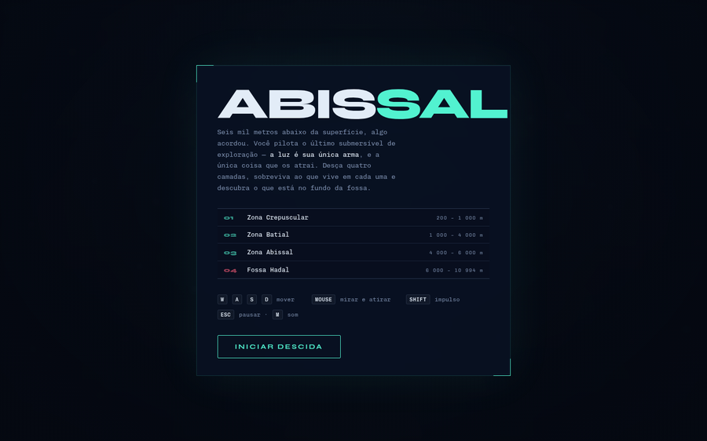
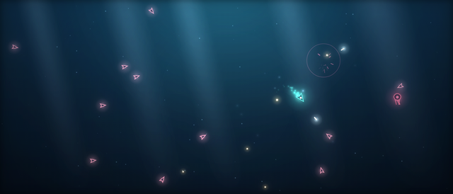
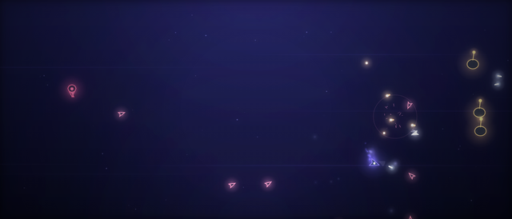
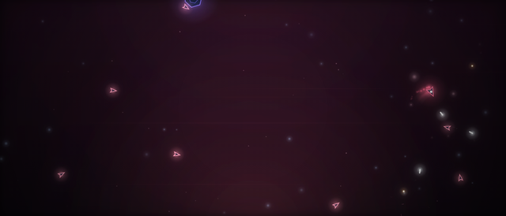
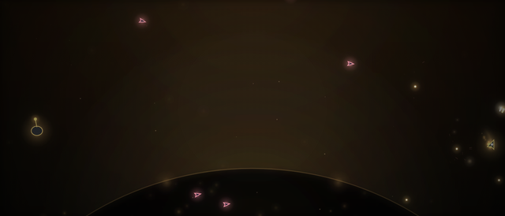
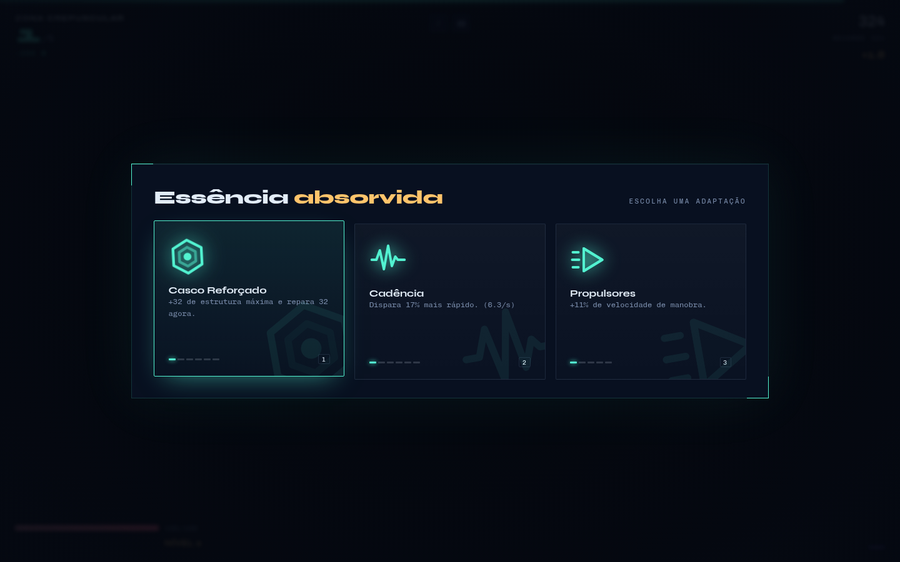

# Abissal

Um jogo de arena bioluminescente que roda no navegador. Você pilota o último
submersível de exploração e desce quatro camadas do oceano — a luz é sua única
arma, e a única coisa que atrai o que vive lá embaixo.

**▶ [Jogar](https://dickson-pinheiro.github.io/abissal/)**



## A descida

A campanha tem começo, meio e fim: quatro camadas, cada uma com bestiário,
chefe e atmosfera próprios. Vencer o chefe final libera a **Correnteza Eterna**,
um modo sem fim com camadas geradas por procedimento.

| | Camada | Profundidade | Atmosfera |
|---|---|---|---|
| 01 | Zona Crepuscular | 200 – 1 000 m | feixes de sol inclinados, que se apagam antes do fundo |
| 02 | Zona Batial | 1 000 – 4 000 m | sem luz nenhuma; correntes atravessando o breu |
| 03 | Zona Abissal | 4 000 – 6 000 m | preto-vinho, bolhas subindo do fundo |
| 04 | Fossa Hadal | 6 000 – 10 994 m | escuro quase total, brasas, e algo imenso no rodapé |

| | |
|---|---|
|  |  |
| **Zona Crepuscular** — a última luz do sol | **Zona Batial** — meia-noite permanente |
|  |  |
| **Zona Abissal** — nenhuma expedição desceu tanto | **Fossa Hadal** — o fundo do mundo |

Os raios de sol somem gradualmente conforme você desce, atrelados à
profundidade real, e a vinheta aperta a cada camada — a pressão fechando.

## Controles

| | |
|---|---|
| `W` `A` `S` `D` | mover |
| mouse | mirar e atirar |
| `Shift` / botão direito | impulso, com breve invulnerabilidade |
| `Esc` · `M` | pausar · som |
| `1` `2` `3` | escolher melhoria |

Sem mouse, a mira trava sozinha na criatura mais próxima. No celular, dois
analógicos aparecem ao toque: esquerda move, direita mira e atira.

## Melhorias

A cada nível você escolhe uma entre três adaptações, com níveis que empilham —
16 no total: salva múltipla, perfuração, ricochete, drones em órbita,
estilhaço, rastreio, escudo estático, críticos, sangria e outras.



## Rodando

Não tem build, dependência nem servidor. É um arquivo HTML único:

```
git clone https://github.com/Dickson-Pinheiro/abissal.git
```

Abra `index.html` no navegador. Funciona offline — sem rede, as duas fontes
caem para as do sistema e o resto continua igual.

## Como acrescentar uma fase

As camadas são dados, não código. Cada uma é um objeto no array `CAMADAS`, no
topo do arquivo, que declara ondas, bestiário, atmosfera e chefe:

```js
{
  id:'nome-da-camada',
  nome:'Zona Nova', faixa:'11 000 – 14 000 m',
  lema:'O texto que aparece na tela de descida.',
  tom:'#52F2D0',                                  // cor de destaque da camada
  amb:{ ceu:[...], raios:0, luzBaixo:.2, neve:{...}, correntes:0,
        subindo:{tipo:'brasa', n:36, cor:'#FFC46B'}, presenca:1, vinheta:.86 },
  profIni:11000, profFim:14000,
  ondas:5, orcBase:30, orcPasso:8, forca:2.4,      // orçamento de inimigos por onda
  bestiario:['larva','cardume','lanterna','carapaca'],
  chefe:{
    arq:'leviata', nome:'O Nome Dele', hp:3000, r:60, vel:60, tom:'#52F2D0',
    atks:[ {t:'radial', n:20, cd:3, spd:150, dano:12} ],
    fases:[ {em:.5, add:[{t:'investida', cd:4, dano:26}]} ]   // ativa aos 50% de vida
  }
}
```

Os chefes são montados a partir de seis tipos de ataque reutilizáveis —
`radial`, `leque`, `espiral`, `invocar`, `minas` e `investida` — e as `fases`
acrescentam ataques conforme a vida cai. Acrescentar uma camada não exige mudar
nenhuma lógica.

## Detalhes técnicos

Canvas 2D puro, sem engine. Bloom em duas larguras com buffers reduzidos,
sprites de brilho em cache, hit-stop, soco de câmera, partículas e tremor de
tela. O áudio é sintetizado em tempo real via Web Audio — não há um arquivo de
som no projeto.

O jogo mede o tempo de quadro e, se atrasar, recolhe sozinho o halo largo e
depois o bloom inteiro, voltando quando melhora. Recorde e progresso ficam no
`localStorage` de cada navegador.
